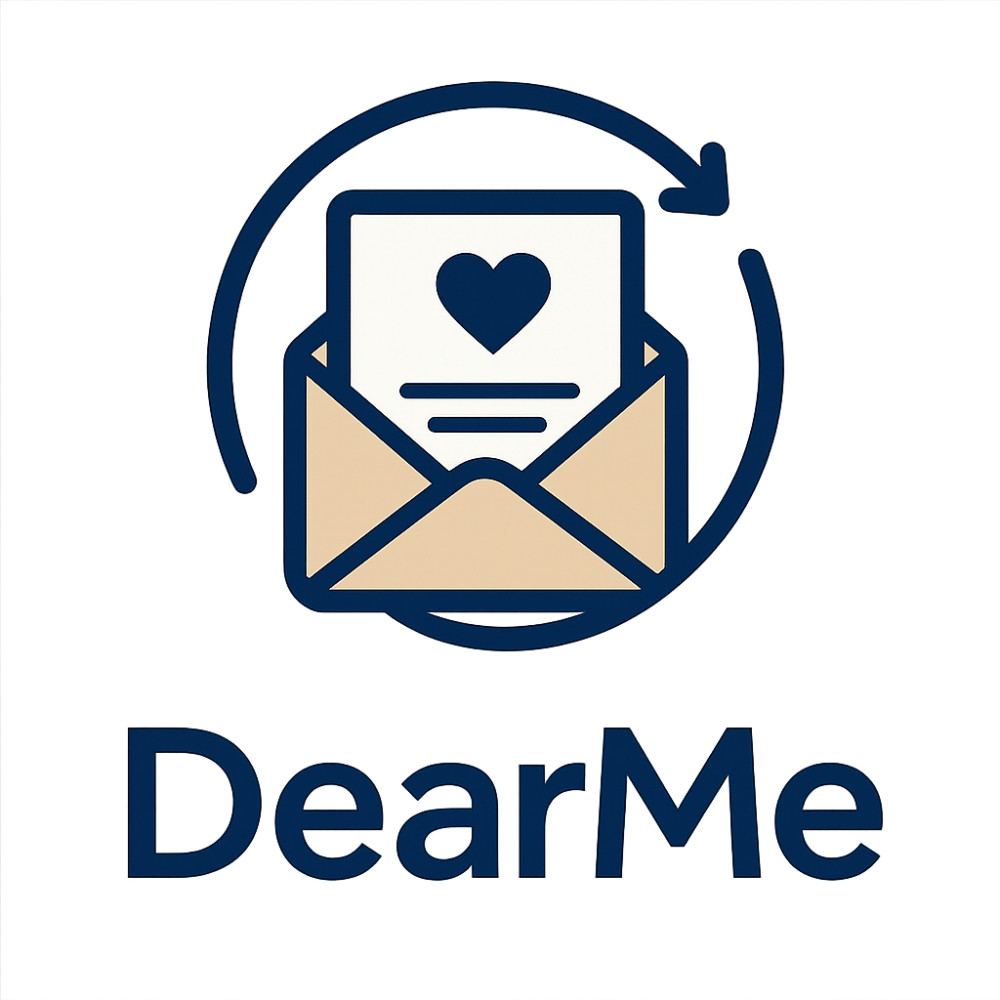
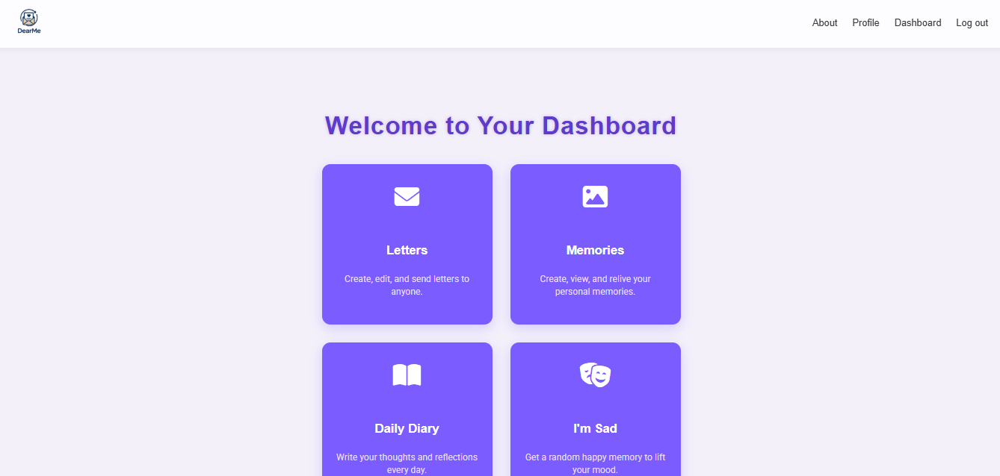

# DearMe

## 📖 Future Diary / Time Capsule App  

## ✨ Description  

**DearMe** is a digital time capsule and future diary app that lets you write letters, store memories, and send messages to your future self or loved ones.  
Whether it’s personal reflections, milestones, or heartfelt notes, you decide when they unlock — days, years, or even decades later.  

With encrypted diaries, multimedia attachments, legacy handovers, and surprise flashbacks, DearMe helps you preserve your journey, relive special moments, and leave a lasting legacy for those who matter most.  

---

## 🎯 Core Concept  
A **Future Diary app** that allows users to:  
- Store letters, daily diary entries, and personal memories.  
- Unlock memories only at specific times in the future (like a time capsule).  
- Keep a **private encrypted diary** safe from everyone, even developers.  
- Share or co-create memories with trusted people (planned feature).  
- Preserve legacy through posthumous letters.  
- Experience random flashbacks and mood-based suggestions (“I’m sad” button).  

---

## 📝 Core Features  

### ✅ Implemented Features
- Letters & Messages: Write letters to yourself or others, schedule delivery dates.  
- Daily Diary (Encrypted): Write secure diary entries with optional favorite music, foods, shows.  
- Memories: Upload and attach photos, videos, audio, or PDFs.  
- Tags & Categorization: Add predefined tags, attach to memories.  
- Locations: Assign locations to memories.  
- “I’m sad” button: Get random uplifting memories.  

### ⚡ Future / Planned Features  
- Joined Memories: Co-create memories with friends or family.  
- Timeline & Albums: Chronological view, shared albums.  
- Random Flashbacks on login.  
- Anniversary unlocks for letters or memories.  
- Notifications & reminders via email/SMS.  
- Legacy Contacts & posthumous delivery fully automated.  
- AR flashbacks (overlay old photos in current location).  
- Sentimental analytics, gamification, AI-powered insights.  
- Memory export bundles (PDF memory books).  

---

## 📂 Data Structure (Database Plan)  

### Models & Relationships

| Model | Relationships |
|-------|---------------|
| **CustomUser** | One-to-many → DailyDiary, Memory, Letter (sender); Many-to-many → Letter (receivers) |
| **Tag** | Many-to-many → Memory |
| **Location** | One-to-many → Memory, DailyDiary |
| **Memory** | Many-to-one → owner (CustomUser); Many-to-many → Tag, DailyDiary, Letter; One-to-one optional → media (photo/audio/video) |
| **DailyDiary** | Many-to-one → owner (CustomUser); Many-to-many → Memory, Location, Letter |
| **Letter** | Many-to-one → sender (CustomUser); Many-to-many → receivers (CustomUser), Memory, DailyDiary; One-to-one optional → attachment |

**Relationship Types:**  
- **One-to-one:** Letter → Attachment (optional)  
- **One-to-many:** User → Memories, DailyDiary entries, Sent Letters  
- **Many-to-many:** Memories ↔ Tags, Letters ↔ Receivers, Diaries ↔ Memories  

---

## 👤 User Stories  

- Write a letter to your future self or others.  
- Keep an encrypted daily diary that only you can read.  
- Attach photos, videos, or voice notes to memories.  
- Tag memories for easy search.  
- Store locations for trips or events.  
- Use “I’m sad” button for motivational memories.  
- Future plans: shared timelines, anniversary unlocks, co-created memories, legacy contacts, notifications.  

---

## ⚙️ Tech Stack  

- **Backend:** Django + PostgreSQL (SQLite for local dev)  
- **Frontend:** Django templates (React optional)  
- **Authentication:** Django built-in sessions  
- **Storage:** Django file storage (images, audio, video, PDFs)  
- **Scheduling:** Celery + Redis for delayed unlocks  
- **Encryption:** Django encrypted fields for diary entries  
- **API (optional):** Django REST Framework  

### Libraries / Frontend Tools Used
- **Flatpickr** – date/time picker (`https://cdn.jsdelivr.net/npm/flatpickr`)  
- **jQuery** – DOM manipulation (`https://cdnjs.cloudflare.com/ajax/libs/jquery/3.7.1/jquery.min.js`)  
- **Tailwind CSS & DaisyUI** – styling and UI components (`https://cdn.tailwindcss.com`, `https://cdn.jsdelivr.net/npm/daisyui@4.12.10/dist/full.css`)  
- **Google Fonts** – Poppins, Roboto, Fredoka (`https://fonts.googleapis.com`)  
- **Font Awesome** – icons (`https://cdnjs.cloudflare.com/ajax/libs/font-awesome/6.5.0/css/all.min.css`)  
- **LightGallery** – media gallery with zoom (`https://cdn.jsdelivr.net/npm/lightgallery@2.7.1/lightgallery.min.js`)  

---

## 🚀 Next Steps (Stretch Goals)  

- Co-created memories with friends/family.  
- Notifications and reminders for unlocks.  
- Memory timelines & albums (including shared timelines).  
- AR flashbacks fully implemented.  
- Cloud storage integration (AWS S3, GCP).  
- Mobile app version.  
- AI-powered insights & sentimental analytics.  
- Gamification & memory export bundles (PDF).  

---

## 📸 Screenshot / Logo  

 
  
---

## 🙌 Attributions  

- Django, Celery, Redis, DRF, encrypted-model-fields.  
- Flatpickr, jQuery, Tailwind CSS, DaisyUI, LightGallery, Font Awesome, Google Fonts.  
- Any additional external libraries or assets used will be listed here.  

---

[Wireframe](https://excalidraw.com/#json=eVwD55XHqNuyxwoT7YneB,JFn3m1v8vgdO_t69H1gQgQ)  
[Trello Board](https://trello.com/invite/b/68c2b808f32436b85099c94e/ATTI33b6548ef1fd1e644dab4ab32d0af29f8C05B60E/dearme)  
[ERD](https://drive.google.com/file/d/1Hx5I5N8FdV6dChbVy_Uwsc6oURAQ7Z3K/view?usp=sharing)
